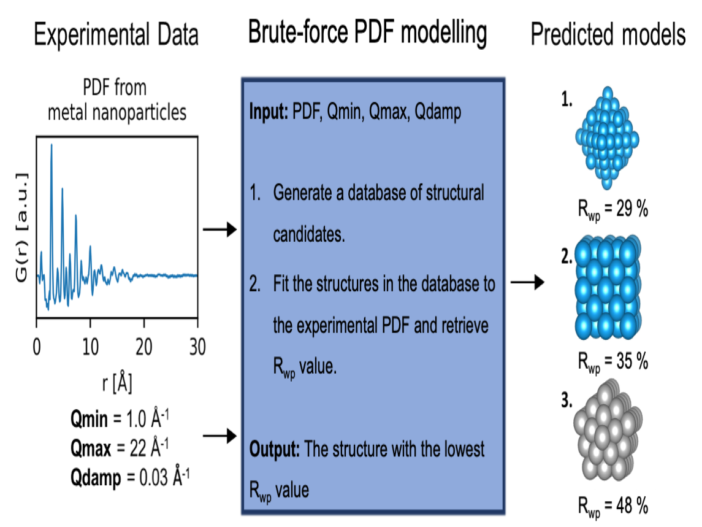

[arXiv]XXX  |  [Paper] XXX

# Brute-force-PDF-modelling

This script provides a brute-force modelling approach to predict the mono-metallic nanoparticle (MMNP) from a Pair Distribution Function (PDF).



Currently the script is limited to MMNPs with up to 200 atoms of the 7 different structure types: Cubic (sc), body-centered cubic (bcc), face-centered cubic (fcc), hexagonal closed packed (hcp), decahedral, icosahedral and octahedral.

1. [Brute-force-PDF-modelling](#brute-force-pdf-modelling)
2. [Getting started (own computer)](#getting-started-own-computer)
   1. [Install requirements](#install-requirements)
   2. [Predict with brute-force approach](#predict-with-brute-force-approach)
3. [Author](#author)
4. [Cite](#cite)
5. [Acknowledgments](#Acknowledgments)
6. [License](#license)  

# Getting started (own computer)
Follow these step if you want to use the brute-force modelling approach locally on your own computer.

## Install requirements
See the [install](/install) folder. 

## Predict with brute-force approach
Simply open the script with:
```
jupyter notebook BruteForce.ipynb
```
And follow the instructions.

# Authors
__Andy S. Anker__<sup>1</sup>   
__Emil T. S. Kjær__<sup>1</sup>  
__Marcus N. Weng__<sup>1</sup>  
__Simon J. L. Billinge__<sup>2, 3</sup>     
__Raghavendra Selvan__<sup>4, 5</sup>  
__Kirsten M. Ø. Jensen__<sup>1</sup>    
 
<sup>1</sup> Department of Chemistry and Nano-Science Center, University of Copenhagen, 2100 Copenhagen Ø, Denmark.   
<sup>2</sup> Department of Applied Physics and Applied Mathematics Science, Columbia University, New York, NY 10027, USA.   
<sup>3</sup> Condensed Matter Physics and Materials Science Department, Brookhaven National Laboratory, Upton, NY 11973, USA.    
<sup>4</sup> Department of Computer Science, University of Copenhagen, 2100 Copenhagen Ø, Denmark.   
<sup>5</sup> Department of Neuroscience, University of Copenhagen, 2200, Copenhagen N.    

Should there be any question, desired improvement or bugs please contact us on GitHub or 
through email: __andy@chem.ku.dk__ or __etsk@chem.ku.dk__.

# Cite
If you use our code or our results, please consider citing our paper. Thanks in advance!
```
@article{kjær2022DeepStruc,
title={DeepStruc: Towards structure solution from pair distribution function data using deep generative models},
author={Emil T. S. Kjær, Andy S. Anker, Marcus N. Weng, Simon J. L. Billinge, Raghavendra Selvan, Kirsten M. Ø. Jensen},
year={2022}}
```

# Acknowledgments
Our code is developed based on the the following approach presented in the publication:
```
@article{Banerjee:lk5048,
author = {Banerjee, Soham and Liu, Chia-Hao and Jensen, Kirsten M. Ø. and Juhás, Pavol and Lee, Jennifer D. and Tofanelli, Marcus and Ackerson, Christopher J. and Murray, Christopher B. and Billinge, Simon J. L.},
title = {Cluster-mining: an approach for determining core structures of metallic nanoparticles from atomic pair distribution function data},
year = {2020}}
```

# License
This project is licensed under the Apache License Version 2.0, January 2004 - see the [LICENSE](LICENSE) file for details.


